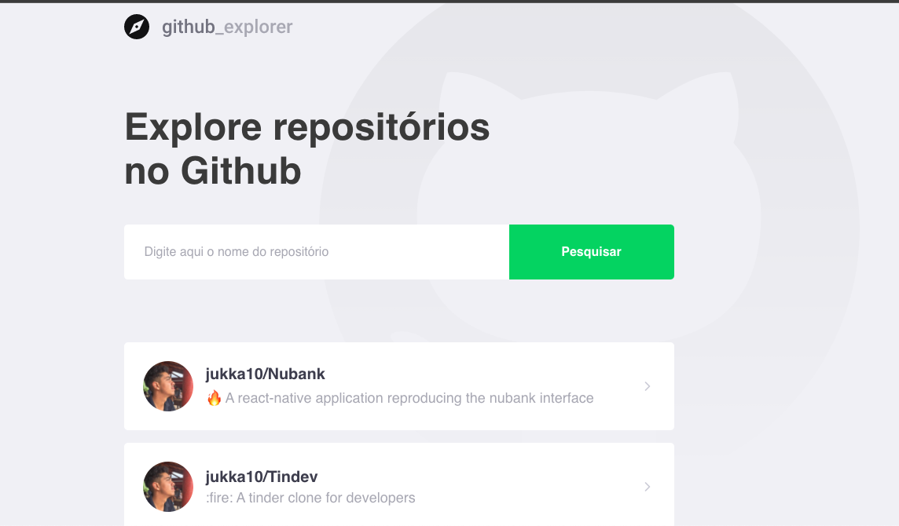
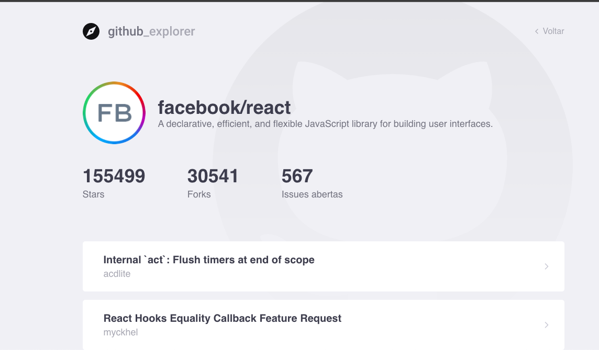

<br />
<p align="center">
  <a>
    
  </a>
</p>

<p align="center">
  Explore amazing Github Repositories. Built with ReactJS and Styled Components.
</p>

<p align="center">
  <a>
    
  </a>

  <a>
    
  </a>
  
  <a>
    
  </a>
  
  <a>
    
  </a>
</p>

## 📖 Table of Contents

- [Features](#features)
- [Installation](#installation)
- [Acknowledgments](#acknowledgments)

## Features

A few of the things you can do with Github Explorer:

- Explore for github repositories and add them to your list
- View the list of issues of a repository
- View the list of forks of a repository
- View the list of stargazers of a repository

<p align="center">
  
</p>

<p align="center">
  
</p>

<br>

## Installation

First of all, you may clone this repo

```
  git clone https://github.com/jukka10/Github-explorer-BootCamp-GoStack.git
```

Run the following scripts in order to execute the application in development mode

```
  // Install the dependencies
  yarn install

  // Start the application
  // yarn start
```

## Acknowledgments

Thanks to [Rocketseat](https://rocketseat.com.br/) for supporting the community and sharing an amazing content.
